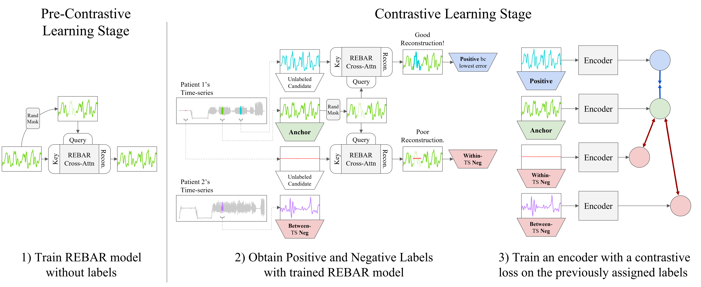

# REBAR: Retrieval-based Reconstruction for Time-series Contrastive Learning
<sub><sup> Please note that the v1 repository has been finished and everything runs properly, but certain aspects, such as full documentation and other QOL changes (e.g. downloading model ckpts) are still a WIP. </sup></sub>

Code for REBAR: Retrieval-Based Reconstruction For Time-series Contrastive Learning (presented at ICLR 2024), which achieves state-of-the-art performance against a wide range of representative self-supervised learning methods and is able to distinguish between semantically similar, but distinct classes. We do this by identifying postive pairs with a simple intuition: *if one sequence is useful for reconstructing another, then they should form a positive pair*.


Please read our paper on arxiv here: https://arxiv.org/abs/2311.00519


<div align="center">
 
<p>REBAR Contrastive Learning Approach<p>
</div>


This repository includes code to reproduce our experimental results, with implementations for our own *REBAR* model, as well all of our benchmarked models (i.e. *Sliding-MSE*, *SimCLR*, *CPC*, *TNC*, *TS2Vec* ). This includes code for running both of our downstream evaluations, Linear Probe Classification and Clusterability Analysis, and code to download and preprocess each of our datasets, directly from their original online repositories. 

Additionally, our codebase is well modularized to allow for easy slot-in implementations of your own SSL method in order to benchmark your own approaches. This can be done by inheriting `BaseModelClass()` from `models/Base_SSLModel.py` and simply overriding the `setup_dataloader()` and `run_one_epoch()` functions. Please refer to the other benchmarks, such as `models/REBAR/REBAR_SSLModel.py` as examples on how to do so. Additional datasets can also be added by following the data processing code in `data/processing/` as examples.


<br/>

-----


## Setup 

For this project we use [miniconda](https://docs.anaconda.com/free/miniconda/miniconda-install/) to manage dependencies. After installing miniconda, we can install the rebar environment with the following terminal commands:

    conda env create -f rebar.yml
    conda activate rebar
    pip install -e .


We can then download and preprocess each of the individual ECG, PPG, and HAR datasets by running this command:

    python data/process/all_processdata.py


-----


## Training and Evaluating REBAR (and other SSL methods)

You can try and evaluate our models by simply running `run_exp.py` with the `-c` argument, as shown below.

    python run_exp.py -c rebar_har
    python run_exp.py -c rebar_ppg
    python run_exp.py -c rebar_ecg

The `-c` refers to the specific dictionary str key associated with a given config that includes all experimental parameters, such as epochs to train or learning rate. The exact REBAR experiment configs associated with `rebar_har` or `rebar_ppg` or `rebar_ecg` can be found in `experiments/configs/rebar_expconfigs.py`. Other models can be simply ran by calling `python run_exp.py -c simclr_har` for example.

-----

If you use our work in your research, please cite
```bibtex
@inproceedings{xu2023rebar,
  title={Retrieval-Based Reconstruction For Time-series Contrastive Learning},
  author={Xu, Maxwell and Moreno, Alexander and Wei, Hui and Marlin, Benjamin and Rehg, James Matthew},
  booktitle={The Twelfth International Conference on Learning Representations},
  year={2023}
}
```

and if you have any further questions, please feel free to email me at maxxu@gatech.edu

